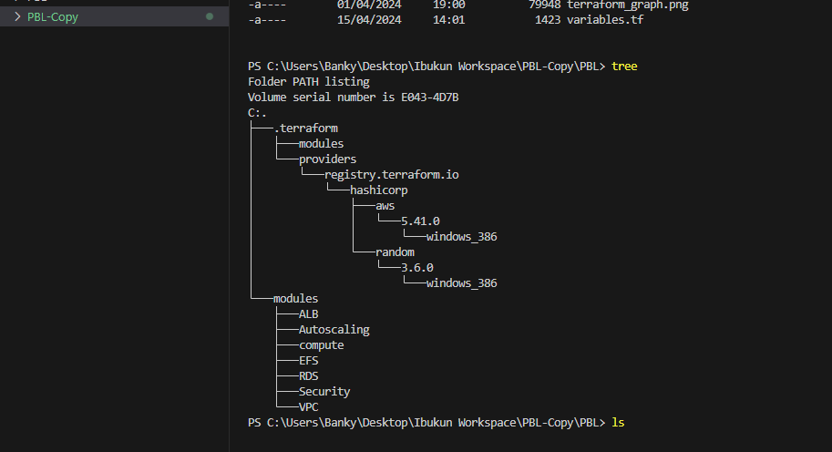
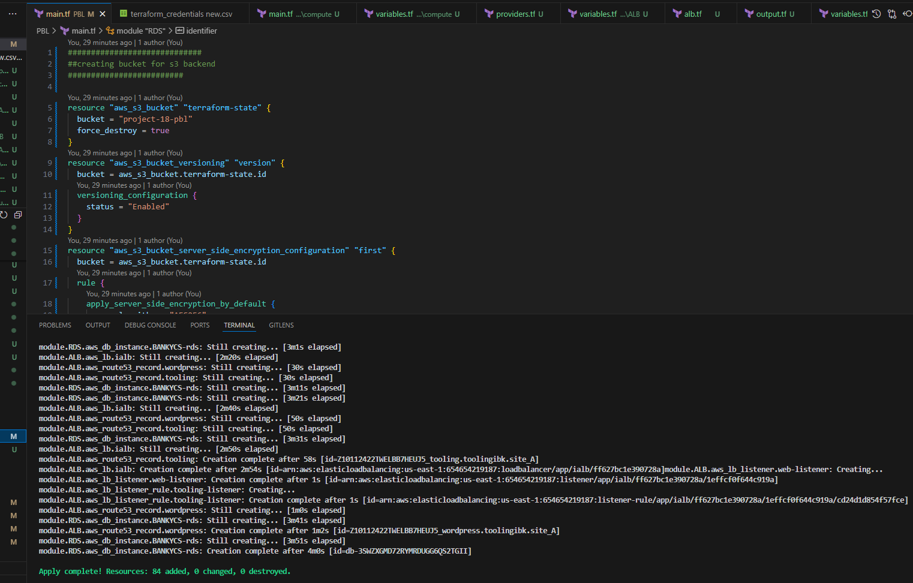
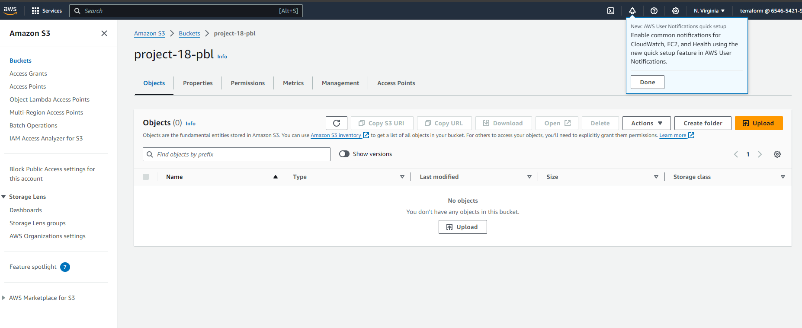
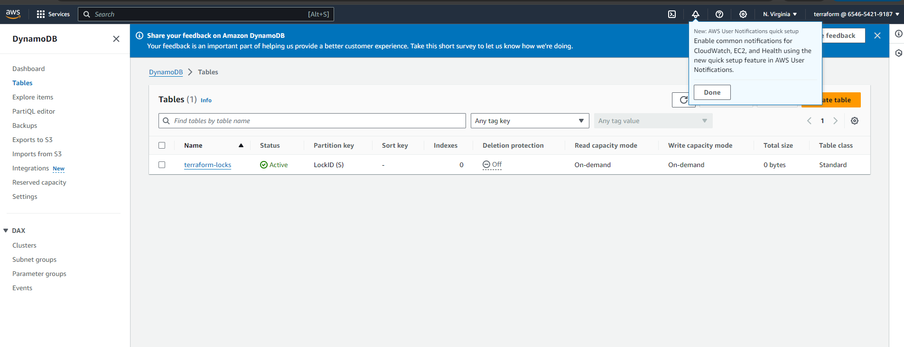
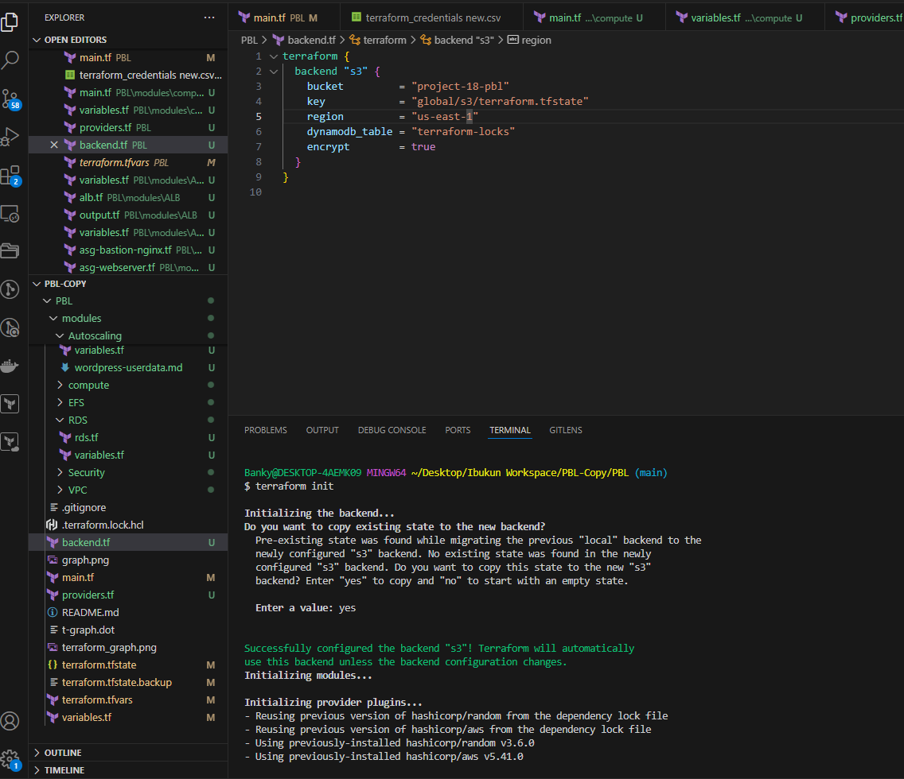
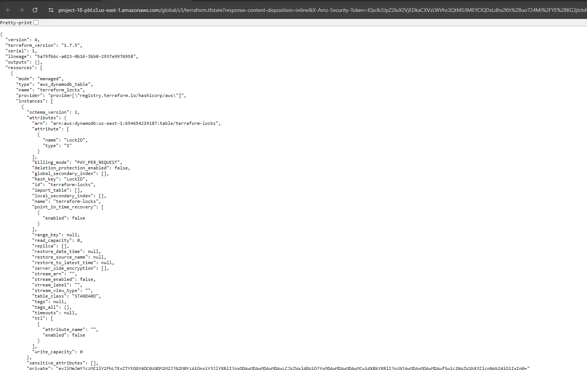
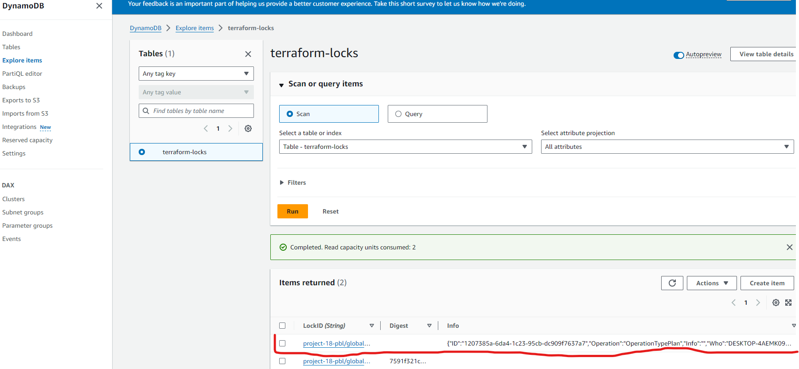

## **Documentation for Project 18**

### Automate Infrastructure With IAC using Terraform Part 3

### Terraform Module and Packer Machine Image Build Automation

### Refactoring our Terraform code into modules for best practice and to structure our TF code. Below is a tree representation of my directory after refactoring

### Creating S3 Bucket and dynamodb to manage our terraform state file and lock file

### S3 Bucket and dynamodb launched with empty files due to S3 Backend not initialized yet

### S3 backend initialized so as to manage our terraform state file and lock file using S£ bucket and Dynamodb

### Tfstate file and State lock being handled by S3 bucket and Dynamodb respectively after running terraform plan

